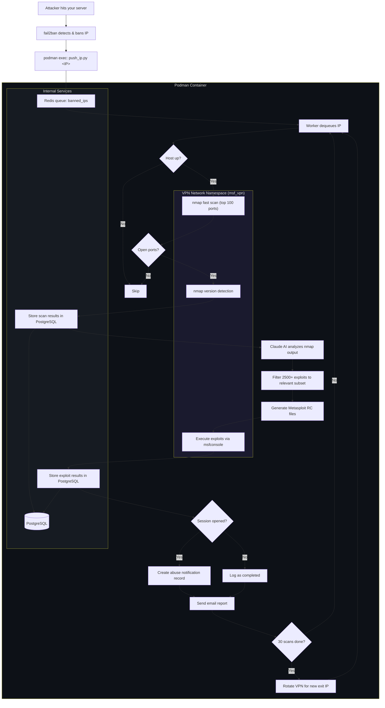
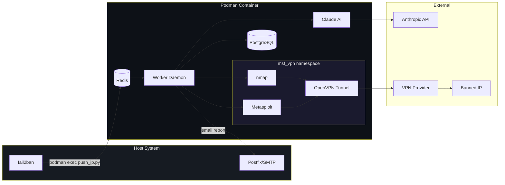
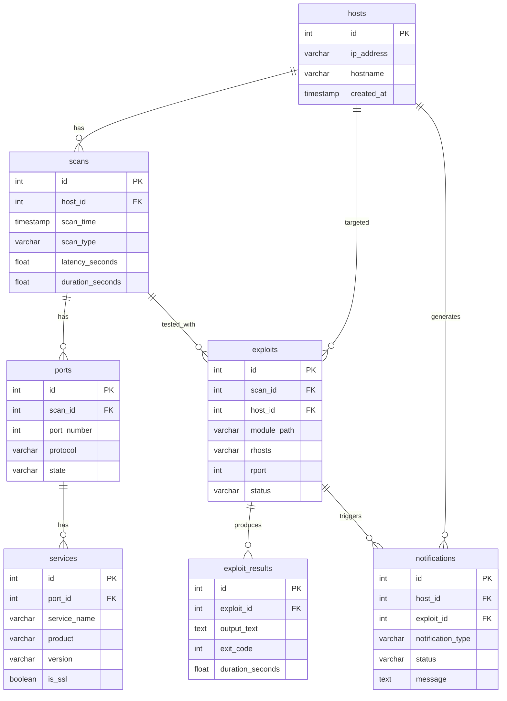

# fail2counter

AI-powered attacker analysis for fail2ban. When fail2ban bans an IP, fail2counter scans the attacker back, identifies their vulnerabilities using AI-selected Metasploit modules, and determines if they are a compromised machine being used as an attack platform.

## LEGAL WARNING

**Unauthorized computer scanning and exploitation is illegal in most jurisdictions.**

By using this software, you acknowledge and accept the following:

### United States
- **Computer Fraud and Abuse Act (CFAA), 18 U.S.C. 1030**: Unauthorized access to computer systems carries penalties of up to 10 years imprisonment for first offenses and up to 20 years for repeat offenses, plus fines up to $250,000.
- **Electronic Communications Privacy Act (ECPA)**: Intercepting electronic communications without authorization carries penalties of up to 5 years imprisonment.

### European Union
- **EU Directive 2013/40/EU (Attacks against information systems)**: Illegal access to information systems carries penalties of at least 2 years imprisonment. Using tools for committing such offences carries at least 3 years.
- **GDPR (Regulation 2016/679)**: Processing personal data (including IP addresses) without lawful basis can result in fines up to EUR 20 million or 4% of annual global turnover.

### United Kingdom
- **Computer Misuse Act 1990**: Unauthorized access carries up to 2 years imprisonment. Unauthorized access with intent to commit further offences carries up to 5 years. Unauthorized acts impairing computer operation carries up to 10 years.

### Other Jurisdictions
Most countries have similar laws criminalizing unauthorized computer access and network scanning. Check your local laws before using this software.

### Authorized Use Only

This tool is intended **exclusively** for:
- **Defensive security** on systems you own or are authorized to test
- **Authorized penetration testing** with written consent
- **Security research** in controlled lab environments
- **Incident response** where you have legal authority to investigate

**You use this software entirely at your own risk. The authors accept no liability for any legal consequences arising from its use.**

---

## How It Works



All scanning and exploit traffic is routed through an OpenVPN tunnel in an isolated network namespace. Your server's real IP is never exposed. The VPN rotates every 30 scans for IP diversity.

## Requirements

- Linux host with `podman` and `fail2ban` installed
- OpenVPN configuration file (.ovpn) from a VPN provider
- Anthropic API key **or** Google Vertex AI credentials

## Installation

```bash
git clone https://github.com/dmzoneill/fail2counter.git
cd fail2counter
sudo ./install.sh
```

The installer asks for 3 things:
1. **Email address** for scan reports
2. **AI provider** (Anthropic API key or GCP Vertex AI project)
3. **OpenVPN config file** (.ovpn) for scan traffic routing

Everything else is handled automatically:
- Builds the container image with all dependencies
- Copies and secures the VPN configuration
- Creates the systemd service
- Installs the fail2ban action

## Usage

```bash
# Start the service
sudo systemctl start fail2counter

# Check status
sudo systemctl status fail2counter

# View logs
sudo podman logs -f fail2counter

# Manually queue an IP for testing
sudo podman exec fail2counter /opt/fail2counter/fail2counter_push_ip.py 1.2.3.4
```

### Fail2ban Integration

Add `fail2counter` to any jail's action list in `/etc/fail2ban/jail.local`:

```ini
[sshd]
enabled = true
action = iptables-multiport[name=sshd, port="ssh"]
         fail2counter
```

Restart fail2ban: `sudo systemctl restart fail2ban`

## Architecture



## What's Inside the Container

| Component | Purpose |
|-----------|---------|
| Redis | Queue between fail2ban and the worker |
| PostgreSQL | Stores scan results, exploit findings, notifications |
| Metasploit Framework | Exploit execution engine |
| nmap | Network scanning |
| OpenVPN | VPN tunnel in isolated network namespace |
| Claude AI | Selects applicable exploits based on scan results |

## Database Schema



## Configuration

All config lives in `/etc/fail2counter/`:

| File | Purpose |
|------|---------|
| `.env` | Main config (email, AI credentials, SMTP settings) |
| `vpn.ovpn` | OpenVPN configuration (copied during install) |
| `gcp-credentials.json` | GCP service account key (Vertex AI only) |

See `.env.example` for all available options. To change configuration after install:

```bash
sudo nano /etc/fail2counter/.env
sudo systemctl restart fail2counter
```

### Environment Variables

| Variable | Required | Default | Description |
|----------|----------|---------|-------------|
| `NOTIFICATION_EMAIL` | Yes | - | Email for scan reports |
| `ANTHROPIC_API_KEY` | One of | - | Direct Anthropic API key |
| `ANTHROPIC_VERTEX_PROJECT_ID` | these | - | GCP project for Vertex AI |
| `ANTHROPIC_VERTEX_REGION` | No | `us-east5` | GCP region |
| `GOOGLE_APPLICATION_CREDENTIALS` | No | - | Path to GCP key JSON |
| `NOTIFICATION_FROM` | No | `fail2counter@localhost` | Email sender address |
| `SMTP_HOST` | No | `localhost` | SMTP server |
| `SMTP_PORT` | No | `25` | SMTP port |
| `VPN_ROTATE_INTERVAL` | No | `30` | Rotate VPN every N scans |

## License

MIT
